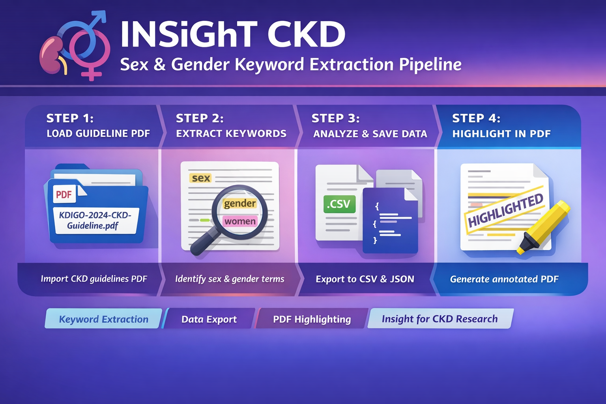

## 🔄 INSiGhT_CKD_Sex_and_Gender_Keyword_Extraction_Pipeline

  

This is:  👉 a rule-based + NLP text mining pipeline 👉 focused on sex/gender terminology detection in CKD clinical practice guidelines 👉 with optional PDF highlighting + contex extraction

This pipeline extracts sex- and gender-related terminology from clinical guideline PDFs.

## Features
- Rule-based keyword detection using curated linguistic patterns
- Sentence-level extraction with contextual windows
- Section-aware mapping of guideline structure
- PDF highlighting of validated keyword matches
- Outputs in CSV and JSON formats

## Methodology
The pipeline combines:
- PDF parsing using PyMuPDF
- Sentence segmentation using spaCy
- Regex-based keyword detection with morphological rules
- Post-processing validation to avoid false positives

## Usage
🚀 Usage Guide

INSiGhT CKD Sex and Gender Keyword Extraction Pipeline

## 1. Setup environment

Create a clean Python environment (recommended):
python -m venv venv
source venv/bin/activate   # (Linux/Mac)
venv\Scripts\activate      # (Windows)
Install dependencies:
pip install -r requirements.txt
Install spaCy model:
python -m spacy download en_core_web_lg
## 2. Prepare input data
Download the CKD guideline PDF
(place it manually — due to licensing it is not included)
## 3. Run keyword extraction
This step extracts all sex/gender-related mentions.
python src/extract_gender_mentions.py
## 4. Highlight keywords in the PDF
This step visualizes detected keywords directly in the document.
python src/highlight_gender_mentions.py
## 5. Run full pipeline (optional)
To run everything in one step:
python run_pipeline.py
This executes: keyword extraction PDF highlighting
## 6. Customizing keywords
Edit:src/gender_keywords.py
You can modify: keyword lists, regex patterns, language (EN/DE), Then rerun the pipeline.
## 7. Adapting to other documents
To use a different guideline: Replace the PDF
Update section mapping in: SECTION_MAP = [...] in extract_gender_mentions.py
## 8. Troubleshooting
spaCy error: OSError: Can't find model 'en_core_web_lg'
Fix: python -m spacy download en_core_web_lg
Make sure the file name matches exactly: CKD-Guideline.pdf
## 9. Expected runtime
Extraction: ~1–3 minutes
Highlighting: ~1–2 minutes (depending on machine)

## 🧠 One-line summary (for users)

Run extract_gender_mentions.py to extract keyword-based evidence, and highlight_gender_mentions.py to visualize results directly in the PDF.
